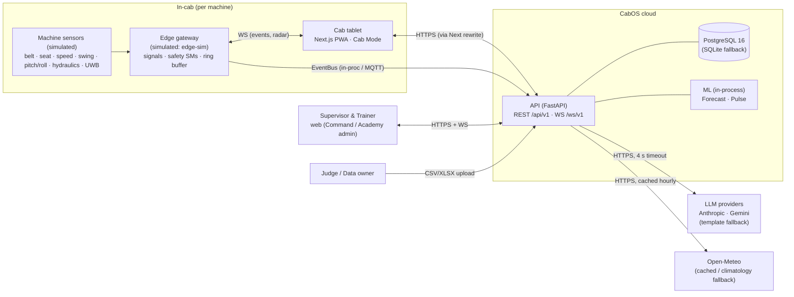
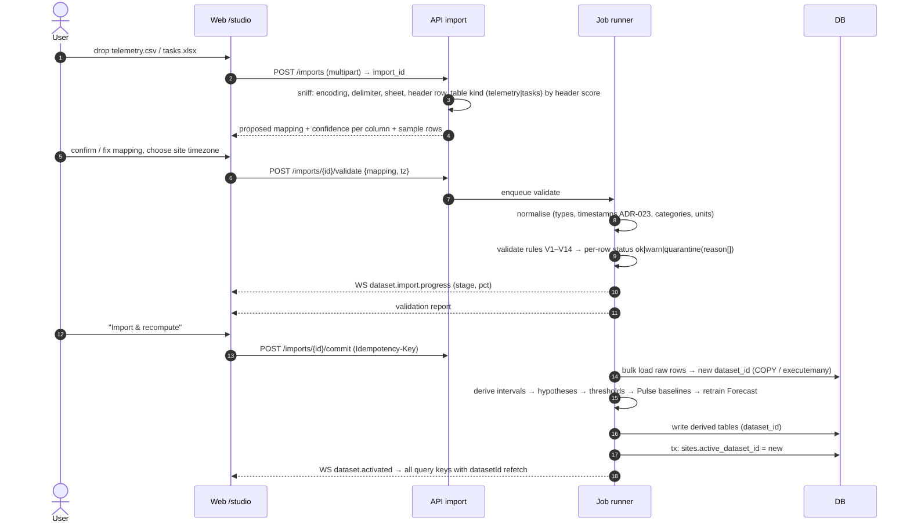
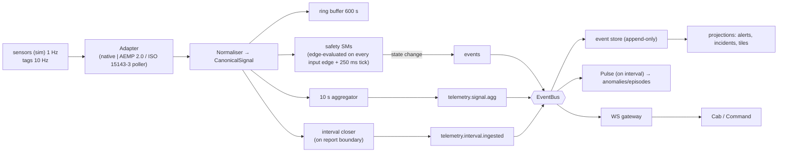
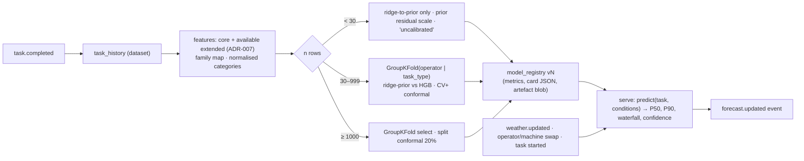
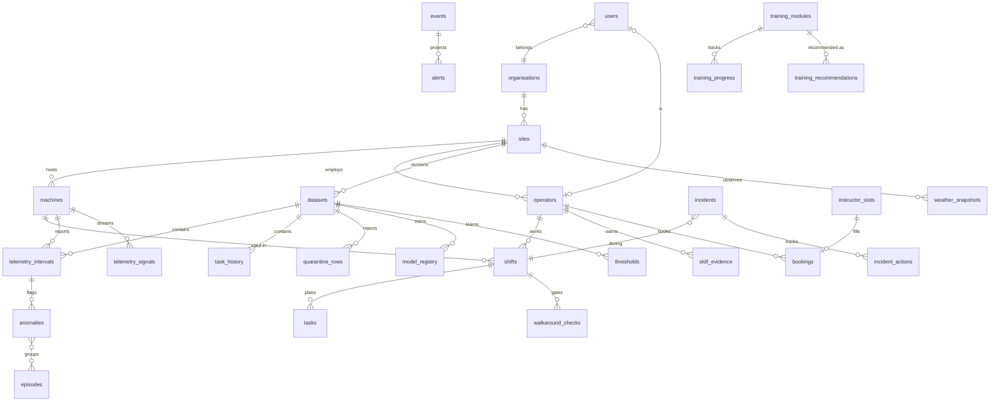
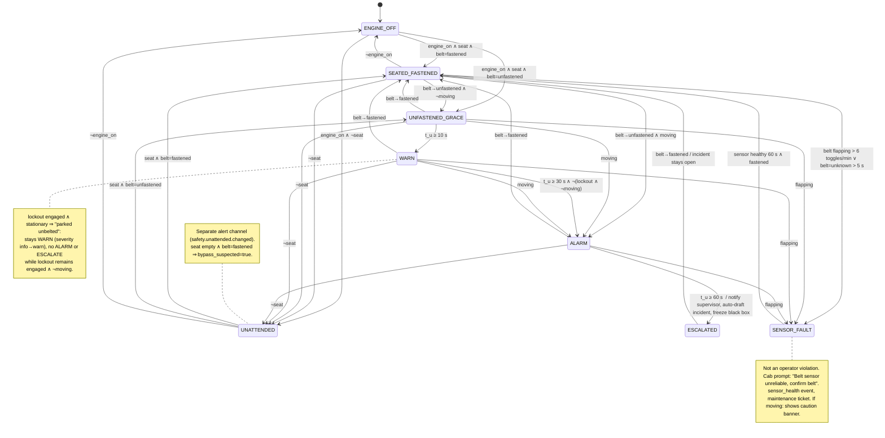
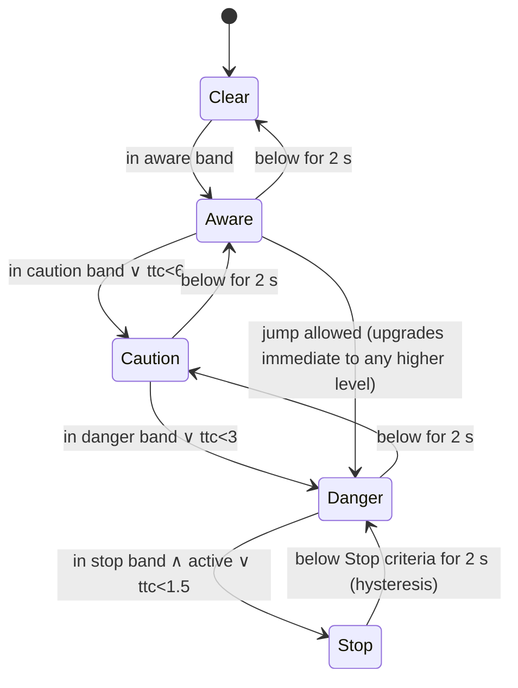
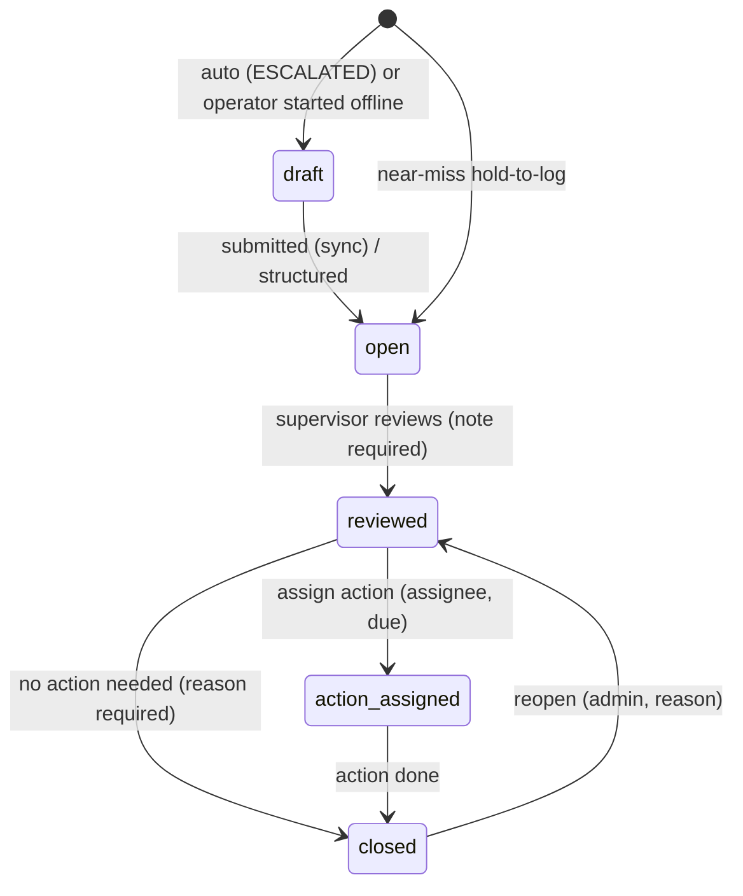
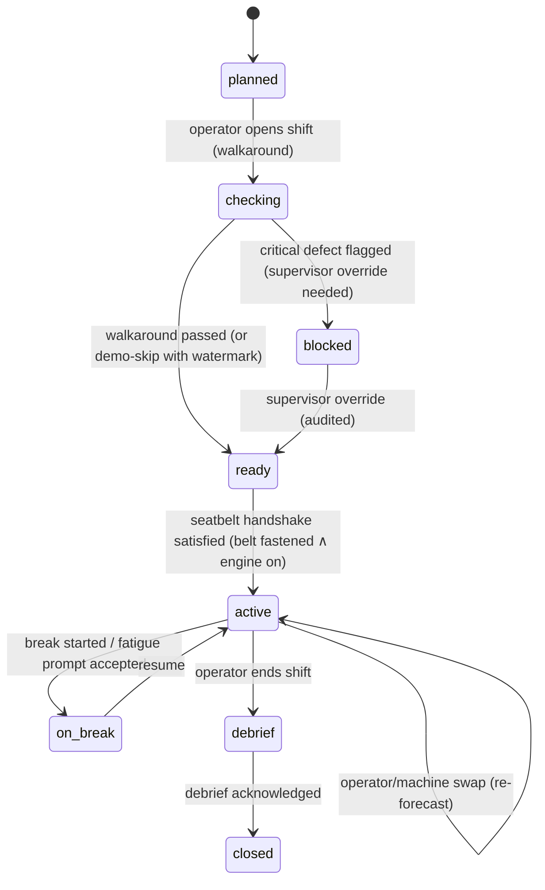

# CabOS: Architecture

> Companion documents: `design.md` (experience and tokens), `build-plan.md` (phases), `decisions.md` (ADRs, referenced here as ADR-nnn).
> This document states **what** the system is and **why**, in enough detail that each phase can be built without re-deciding.

---

## 0. Domain reasoning (read before the diagrams)

**Two time scales, one operator.** Telemetry rows are *behaviour* over irregular windows. Task rows are *outcomes* per task. The product loop is **detect → explain → coach → verify**:

1. **Detect.** Edge rules (seatbelt, proximity, conditions) fire in < 300 ms. Pulse finds interval-level anomalies and compound episodes.
2. **Explain.** Every alert and anomaly carries evidence values, the threshold with its provenance (ADR-019) and a plain-language sentence (template first, LLM phrasing optional).
3. **Coach.** Anomalies and incidents map to Academy skill nodes, which produce recommendations.
4. **Verify.** After a lesson, the related metric is tracked for 7 days against the pre-lesson baseline, and the delta is shown with n.

**What the data can and cannot support** (Phase 0 findings, verified numerically):

| Finding | Consequence |
|---|---|
| `engine_hours` is cumulative; `fuel/cycles/idle` reproduce §3 only as per-interval amounts | Interval semantics in ADR-005 |
| 05-02 09:00: 222 engine-min, 60 idle, **1 cycle**, 2.0 L → coverage 0.32, 0.54 L/h | Coverage-ratio gap detection (ADR-005). Wall gap alone is *not* a gap (overnight). |
| `safety_alert_triggered` = `seatbelt == Unfastened` in 4/4 rows | H2: the legacy alert is single-signal. CabOS replaces it and reports agreement % on any dataset. |
| Task table has no operator, machine or time | Core vs extended schema (ADR-007) |
| Planner MAPE: 13.2% (std) vs 16.3% (÷ estimate) | ADR-006 |
| Skill ⟂̸ weather in the sample (both Expert rows Sunny) | H7 confounding report and honest model card |
| n = 3 closed intervals, 5 tasks | Thresholds shrink to priors (ADR-019); intervals "uncalibrated" (ADR-010); ridge-to-prior (ADR-008) |

**Invariant.** *No LLM output influences whether a safety alert fires, escalates or clears.* This is enforced structurally (ADR-017): `cabos_core.safety` has no import path to `cabos_core.language`.

---

## 1. System context



Every external arrow has a fallback: LLM → `TemplateProvider`; weather → last cached snapshot → seeded climatology; camera → code entry or picker; mic → text input; MQTT → in-process bus.

---

## 2. Containers and components

```mermaid
flowchart TB
  subgraph web["apps/web (Next.js App Router)"]
    L["/ landing"]; ON["/onboarding"]; CAB["/cab/* Cab Mode"]; CMD["/command/*"]; TR["/academy/* (operator) · /trainer/*"]; DS["/studio Data Studio"]; DIR["/director"]; DSG["/design"]
    RT["realtime client<br/>WS → zod → Zustand"]; OQ["offline queue<br/>IndexedDB (idb)"]; I18N["next-intl en/hi"]
  end
  subgraph api["services/api (FastAPI)"]
    R["routers /api/v1"]; WSG["WS gateway<br/>channels · tickets · heartbeat"]; JOBS["job runner<br/>(APScheduler + asyncio tasks)"]
    IMP["import pipeline<br/>map→validate→quarantine→load"]; DER["derive service"]; PUL["Pulse service"]; FC["Forecast service<br/>registry"]; INC["Incident service"]; ACA["Academy service"]; COP["Copilot service"]; WXS["Weather service"]; AUTH["authz policy"]
    STORE["event store writer"]
  end
  subgraph edge["services/edge-sim"]
    REPLAY["replayer<br/>(CSV intervals → timeline)"]; SYN["1 Hz / 10 Hz synthesiser"]; SITE["site context<br/>(trucks, workers)"]; SAFE["safety runtime<br/>(uses cabos_core.safety)"]; RB["ring buffers (600 s)"]; SCN["scenario director handler"]
  end
  subgraph core["packages/cabos-core (pure Python)"]
    C1["contracts"]; C2["intervals"]; C3["rules · baselines · episodes · idle"]; C4["safety: seatbelt · proximity · conditions · fatigue"]; C5["forecast: features · ridge-prior · hgb · conformal · waterfall"]; C6["hypotheses"]; C7["schema mapping · normalisers"]; C8["language (templates, provider protocol)"]
  end
  BUS{{"EventBus"}}
  edge --> BUS --> api
  api --> core
  edge --> core
  web <--> api
```



| Component | Responsibility | Owns state? |
|---|---|---|
| **cabos-core** | All domain logic as pure functions/classes: no I/O, deterministic given `now` and seed. `mypy --strict`. | No |
| **edge-sim** | Turns interval data and scenario injections into consistent 1 Hz machine signals and 10 Hz tag positions. Runs the safety state machines per machine. Keeps ring buffers. Publishes events. | In-memory SM state + ring buffers |
| **api / routers** | REST resources, validation, authz, idempotency. | — |
| **api / WS gateway** | Subscribe/auth channels, fan-out from the bus, 1 s heartbeat, resume from `last_event_id` (replayed from the event store). | Connection registry |
| **api / event store writer** | Persists every bus event (except `telemetry.signal.frame` and `radar.*`) to the append-only `events` table and projects it into read models (`alerts`, `incidents`, …). | `events`, projections |
| **api / import pipeline** | Data Studio: sniff → map → normalise → validate → quarantine → bulk load → derive → retrain → rebaseline → activate (ADR-020). | `datasets`, `import_jobs` |
| **api / Pulse** | Derived metrics, rules, robust z, IsolationForest, episodes, idle classification, learned thresholds. | `anomalies`, `episodes`, `thresholds` |
| **api / Forecast** | Train, select, calibrate, register, serve. Re-forecast on `weather.updated`, `shift.operator_swapped` and `shift.machine_swapped`. | `model_registry`, `tasks.p50/p90` |
| **api / Incident** | Lifecycle, black box attach, structuring (LLM or template), audit log. | `incidents`, `audit_log` |
| **api / Academy** | Recommendations from anomalies and incidents, progress, drills, bookings, skill evidence, verify loop. | training tables |
| **api / Copilot** | Deterministic intent router → data fetch → phrase (LLM or template). | — |
| **api / Weather** | Open-Meteo hourly fetch per site, cache, climatology fallback, Director overrides. | `weather_snapshots` |
| **web** | Rendering, interaction, offline queue, i18n. **Never computes safety state** (ADR-021). | Client stores |

---

## 3. Data flows

### 3.1 File import (Data Studio)



**Schema mapping.** For each source header, compute a normalised token form (lowercase, strip units in parentheses into a `unit_hint`, collapse separators, expand synonyms from `synonyms.yaml`: `fuel|diesel → fuel`, `idle|idling → idle`, `belt|seatbelt|seat_belt → seatbelt`, …). Score candidates by `max(token Jaccard, rapidfuzz.token_set_ratio/100)` plus a **value-shape bonus** (for example a column parsing ≥ 95% as timestamps boosts `timestamp`; values in {fastened, unfastened, yes, no, 0, 1} boost `seatbelt_status`). Solve the assignment with Hungarian matching on `1 − score` so two columns cannot claim one target. Confidence ≥ 0.85 is auto-accepted, 0.6–0.85 is suggested, and < 0.6 needs the user.

**Validation rules** (each yields `warn` or `quarantine` with a machine-readable reason):

| # | Rule | Severity |
|---|---|---|
| V1 | Required column missing after mapping | block import |
| V2 | Unparseable value for typed column | quarantine row |
| V3 | Negative fuel / cycles / idle | quarantine |
| V4 | Exact duplicate row | drop duplicate, count reported (kept in quarantine table as `duplicate`) |
| V5 | Same `(machine_id, timestamp)` with different values | quarantine both, reason `conflicting_duplicate` |
| V6 | Out-of-order timestamps per machine | re-sort, warn (count) |
| V7 | Δengine_hours < 0 | interval `reset`: new baseline, warn |
| V8 | engine_min > wall_min × 1.05 + 2 | `clock_error` flag |
| V9 | idle_min > engine_min | quarantine `idle_exceeds_engine_time` |
| V10 | Coverage < 0.5 or fuel rate < floor (ADR-005) | `telemetry_gap` flag (kept) |
| V11 | New category value (task_type, weather, skill) | warn and list; mapped via normaliser/family |
| V12 | actual_time_min ≤ 0 or ratio outside [0.2, 5] | quarantine `implausible_duration` |
| V13 | Null in a feature column | keep; the feature is imputed as "missing" category / median with a flag, never silently dropped |
| V14 | Unit mismatch (for example fuel in gallons from `unit_hint`, or engine hours looking like minutes by magnitude) | convert when unit known, else warn |

**Performance target:** 100k telemetry rows in < 60 s on a laptop. Budget: parse 3 s (pandas `pyarrow` engine), normalise and validate 4 s (vectorised), sort and group-diff 1 s, load 8 s (SQLite executemany in one tx) / 3 s (PG COPY), derive + thresholds 3 s, IsolationForest 5 s (200 trees, max_samples = 256), forecast retrain 10 s (HGB with early stopping) → about 35 s with headroom.

### 3.2 Live telemetry ingest



**Adapter interface for mixed fleets.** `TelemetryAdapter.poll(since) -> Iterable[CanonicalReading]`. `NativeAdapter` handles edge-sim. `Aemp2Adapter` maps ISO 15143-3 / AEMP 2.0 fleet snapshot elements (`CumulativeOperatingHours`, `FuelUsed`/`FuelUsedLast24`, `CumulativeIdleHours`, `Location`, `EngineCondition`) to canonical fields, converting **cumulative** counters to per-interval deltas. That is the inverse of the organiser format, so the adapter declares `counter_semantics: cumulative|per_interval` per field. A fixture-based test proves both paths yield the same intervals.

### 3.3 Forecast training and inference



Inference is < 5 ms (a ridge dot product plus an HGB predict on one row, both kept in memory). The 150 ms budget covers the HTTP round trip.

---

## 4. Event catalogue

### 4.1 Envelope (all events)

```json
{
  "$id": "cabos/event-envelope/v1",
  "type": "object",
  "required": ["id","type","v","occurred_at","source","site_id","payload"],
  "properties": {
    "id":            {"type":"string","description":"UUIDv7 (time-ordered)"},
    "type":          {"type":"string","pattern":"^[a-z]+(\\.[a-z_]+)+$"},
    "v":             {"type":"integer","minimum":1,"description":"payload schema version"},
    "occurred_at":   {"type":"string","format":"date-time","description":"UTC, source clock"},
    "recorded_at":   {"type":"string","format":"date-time","description":"UTC, server clock (set by store)"},
    "source":        {"enum":["edge","api","web","director","import"]},
    "org_id":        {"type":"string"},
    "site_id":       {"type":"string"},
    "machine_id":    {"type":["string","null"]},
    "operator_id":   {"type":["string","null"]},
    "shift_id":      {"type":["string","null"]},
    "dataset_id":    {"type":["string","null"]},
    "correlation_id":{"type":["string","null"],"description":"groups a cascade, e.g. one Director injection"},
    "causation_id":  {"type":["string","null"],"description":"event id that caused this one"},
    "seq":           {"type":"integer","description":"per-machine monotone counter from edge; detects gaps and duplicates"},
    "payload":       {"type":"object"}
  }
}
```

**Delivery semantics.** At-least-once from the edge. The store deduplicates on `id`. Consumers are idempotent. A per-machine `seq` gap triggers `telemetry.coverage.degraded`. Out-of-order events (by `occurred_at`) are stored and projections apply them in `occurred_at` order within a 5 s reorder window.

### 4.2 Catalogue

| Type | Source | Persisted | Payload (required fields) |
|---|---|---|---|
| `telemetry.signal.frame` | edge | no (ring buffer) | `t, engine_on:bool, seat_occupied:bool, belt:"fastened"\|"unfastened"\|"unknown", lockout_engaged:bool, ground_speed_kmh, swing_rate_dps, swing_accel_dps2, boom_raised:bool, hydraulics_active:bool, pitch_deg, roll_deg, fuel_rate_lph, activity:"off"\|"idle"\|"digging"\|"swinging"\|"travelling"` |
| `telemetry.signal.agg` | edge | `telemetry_signals` | `window_start, window_s:10, channels:{name:{min,max,mean,last}}` |
| `telemetry.interval.ingested` | edge/import | `telemetry_intervals` | `interval_id, start, end, engine_min, wall_min, fuel_l, cycles, idle_min, belt, legacy_alert, derived:{…}, quality:"ok"\|"degraded", flags[]` |
| `telemetry.coverage.degraded` | edge/api | yes | `reason:"seq_gap"\|"stale_stream"\|"coverage_ratio"\|"fuel_floor", since, evidence{}` |
| `machine.state.changed` | edge | yes | `from, to` (activity) |
| `safety.seatbelt.state_changed` | edge | yes | `from, to` (see §7.1), `trigger, inputs{}, elapsed_unfastened_s, severity:"info"\|"warn"\|"alarm"\|"critical"` |
| `safety.unattended.changed` | edge | yes | `active:bool, engine_on, seat_occupied, belt, bypass_suspected:bool` |
| `safety.sensor_health.changed` | edge | yes | `sensor:"belt"\|"seat"\|"uwb"\|…, status:"ok"\|"flapping"\|"stuck"\|"implausible", toggles_per_min?, evidence{}` |
| `safety.proximity.level_changed` | edge | yes | `from, to` (Clear/Aware/Caution/Danger/Stop), `tag_id, tag_kind:"worker"\|"vehicle", distance_m, bearing_deg, closing_mps, ttc_s?, zone_multiplier, machine_activity` |
| `radar.frame` | edge | no | `t, machine:{heading_deg, swing_deg, activity}, zones:{aware_m,caution_m,danger_m,stop_m}, tags:[{id,kind,x_m,y_m,vx,vy,level}]` (10 Hz) |
| `safety.conditions.limit_changed` | api | yes | `limit:"wind_demolition"\|"wind_lift"\|"rain_slope"\|"heat_fatigue"\|"darkness", active:bool, value, threshold, unit, message_key` |
| `safety.fatigue.prompted` | edge | yes | `continuous_min, limit_min, reason:"continuous"\|"heat", heat_index_c?` |
| `weather.updated` | api | `weather_snapshots` | `temperature_c, apparent_c, humidity, precip_mm_h, wind_kmh, gust_kmh, visibility_m, is_day, source:"open-meteo"\|"cache"\|"climatology"\|"director", fetched_at` |
| `pulse.anomaly.detected` | api | `anomalies` | `anomaly_id, kind` (rule id / `robust_z` / `iforest` / unsafe pattern), `layer:1\|2\|3, severity, subject:{interval_id?\|window?}, evidence:[{metric,value,threshold,threshold_provenance}], explanation, suggested_action, skill_node?` |
| `pulse.episode.opened` / `.closed` | api | `episodes` | `episode_id, kind:"unattended_idle"\|"fatigue_drift"\|…, member_ids[], started, ended?, score` |
| `forecast.updated` | api | `tasks` p50/p90 | `task_id, p50_min, p90_min, planner_min, confidence:"normal"\|"low", reasons[], waterfall:[{factor,label,log_delta,pct}], model_version, trigger` |
| `forecast.model.trained` | api | `model_registry` | `version, champion, n_real, metrics{mape, mdape, coverage90}, cv_grouping` |
| `shift.state_changed` | api | yes | `from, to` (§7.4) |
| `shift.operator_swapped` / `.machine_swapped` | api | yes | `from_id, to_id` |
| `task.progress` | api/edge | `tasks` | `task_id, pct, elapsed_min, eta_p50_min` |
| `task.completed` | api | `tasks`, `task_history` | `task_id, actual_min, conditions_snapshot` |
| `incident.created` | api | `incidents` | `incident_id, severity, category, origin:"operator"\|"auto_escalation", has_blackbox` |
| `incident.status_changed` | api | `incidents` | `from, to, actor_id, note?` |
| `training.recommended` | api | `training_recommendations` | `module_id, skill_node, because:[{kind, ref_id, text}]` |
| `training.completed` | api | `training_progress` | `module_id, score, duration_s` |
| `skill.evidence.recorded` | api | `skill_evidence` | `skill_node, kind:"telemetry_streak"\|"drill"\|"simulator"\|"instructor", value, window` |
| `dataset.import.progress` | api | `import_jobs` | `import_id, stage, pct, counts{}` |
| `dataset.activated` | api | yes | `dataset_id, previous_dataset_id, summary{}` |
| `director.scenario.triggered` | director | yes | `scenario:1..10, params{}` (becomes `correlation_id` for the cascade) |

The JSON Schema for each payload is generated from `cabos_core.contracts.events` into `packages/contracts/schema/events/*.json` (ADR-002).

---

## 5. Database schema

### 5.1 ERD



### 5.2 Tables

Conventions: PK `id` is UUIDv7 as `uuid` (PG) or `char(36)` (SQLite), except where natural keys are imported. Timestamps are `timestamptz` UTC. `created_at` / `updated_at` exist on all mutable tables. JSON is `jsonb` on PG and `json` on SQLite. **(D)** = carries `dataset_id` (ADR-020).

| Table | Columns (type) | Keys & indexes |
|---|---|---|
| **organisations** | id, name, slug | uq(slug) |
| **sites** | id, org_id→organisations, name, timezone (IANA), lat, lon, active_dataset_id→datasets NULL, zone_multipliers json (rain/fog/night), co2_kg_per_l numeric default 2.68, fuel_inr_per_l numeric | idx(org_id) |
| **users** | id, org_id, display_name, role enum(operator,supervisor,trainer,admin), operator_id→operators NULL, locale, badge_code | uq(badge_code) |
| **machines** | id, site_id, external_id (e.g. EXC001), model, type enum(excavator,wheel_loader,dozer,grader,other), year, age_yrs (generated/derived), tail_swing_radius_m numeric, max_slope_deg, spec json, qr_code, last_service_at, engine_hours_latest | uq(site_id, external_id), uq(qr_code) |
| **operators** | id, site_id, external_id, display_name, skill_level enum(beginner,intermediate,expert), experience_yrs, certifications json[], language, calibration json | uq(site_id, external_id) |
| **datasets** | id, site_id, kind enum(demo,sample,synthetic,upload), label, source_files json, row_counts json, created_by, status enum(importing,ready,failed,archived), is_synthetic bool | idx(site_id, created_at) |
| **import_jobs** | id, dataset_id, stage, pct, mapping json, tz, report json, error, idempotency_key | uq(idempotency_key) |
| **quarantine_rows** (D) | id, dataset_id, table_kind, source_row int, raw json, reasons text[] | idx(dataset_id, table_kind) |
| **shifts** | id, site_id, operator_id, machine_id, planned_start, planned_end, started_at, ended_at, state enum(§7.4), walkaround_passed bool, demo_watermark bool, debrief json | idx(operator_id, planned_start), idx(site_id, state) |
| **walkaround_checks** | id, shift_id, item enum(tracks,hydraulics,mirrors,lights,seatbelt,extinguisher,fluids,…), result enum(pass,flag), note, photo_asset_id NULL, idempotency_key | uq(shift_id,item) |
| **tasks** | id, shift_id, site_id, external_id, task_type, task_family, sequence int, planner_estimate_min, p50_min, p90_min, confidence, waterfall json, model_version, started_at, completed_at, actual_min, status enum(planned,active,done,skipped), conditions_snapshot json | idx(shift_id, sequence) |
| **task_history** (D) | id, dataset_id, external_id, task_type, task_family, weather, operator_skill, machine_age_yrs, estimated_time_min, actual_time_min, log_ratio (stored), ext json (extended fields ADR-007), origin enum(import,completed_in_app,synthetic) | idx(dataset_id, task_type) |
| **telemetry_intervals** (D) | id, dataset_id, machine_id, operator_id, start_at NULL, end_at, engine_hours_end, engine_min, wall_min, fuel_l, cycles, idle_min, belt enum, legacy_alert bool, idle_ratio, fuel_per_cycle, fuel_rate_lph, cycles_per_eh, utilisation, coverage, quality enum(ok,degraded,open,reset), flags text[], idle_split json | idx(dataset_id, machine_id, end_at), idx(dataset_id, operator_id, end_at); Timescale hypertable on end_at |
| **telemetry_signals** | machine_id, window_start, window_s, channels json | pk(machine_id, window_start); hypertable |
| **signal_captures** | id, machine_id, around_event_id, frames json (gz b64) | idx(machine_id) |
| **events** (append-only) | id (UUIDv7), type, v, occurred_at, recorded_at, source, site_id, machine_id, operator_id, shift_id, dataset_id, correlation_id, causation_id, seq, payload json | pk(id); idx(site_id, recorded_at); idx(machine_id, occurred_at); idx(type, recorded_at); idx(correlation_id). No UPDATE/DELETE grants (PG); trigger rejects on SQLite |
| **alerts** (projection) | id, event_id, site_id, machine_id, kind, level, opened_at, cleared_at, acked_by, acked_at, message_key, context json | idx(site_id, cleared_at NULLS FIRST, opened_at desc) |
| **anomalies** (D) | id, dataset_id, machine_id, operator_id, interval_id NULL, window_start, window_end, layer, kind, severity, evidence json, explanation, suggested_action, skill_node, status enum(new,seen,coached,dismissed), attributable bool | idx(dataset_id, operator_id, window_end desc) |
| **episodes** (D) | id, dataset_id, kind, operator_id, machine_id, started_at, ended_at, member_anomaly_ids json, score | idx(operator_id, started_at) |
| **thresholds** (D) | id, dataset_id, key, scope enum(operator,machine,fleet,prior,override), scope_id, value, n, source, overridden_by NULL | uq(dataset_id,key,scope,scope_id) |
| **incidents** | id, site_id, shift_id, machine_id, operator_id, reported_by, occurred_at, severity enum(near_miss,first_aid,property_damage,lost_time), category, description_raw, structured json, structuring_source enum(llm,template,manual), blackbox json (gz), weather json, status enum(open,reviewed,action_assigned,closed), origin, idempotency_key | uq(idempotency_key); idx(site_id,status,occurred_at) |
| **incident_actions** | id, incident_id, assignee_id, action, due_at, done_at | idx(incident_id) |
| **audit_log** | id, actor_id, entity, entity_id, action, before json, after json, at | idx(entity, entity_id) |
| **training_modules** | id, slug, title_key, format enum(micro_lesson,drill,simulator,instructor), skill_nodes text[], duration_s, content json, locale_variants json | uq(slug) |
| **training_recommendations** | id, operator_id, module_id, because json, created_at, status enum(new,started,done,dismissed) | idx(operator_id,status) |
| **training_progress** | id, operator_id, module_id, started_at, completed_at, score, attempts, verify json (metric, baseline, after, n) | uq(operator_id,module_id) |
| **skill_evidence** | id, operator_id, skill_node, kind, value, window_start, window_end, source_ref | idx(operator_id, skill_node) |
| **instructor_slots** | id, site_id, trainer_id, starts_at, ends_at, topic | idx(site_id, starts_at) |
| **bookings** | id, slot_id, operator_id, status enum(booked,cancelled,attended), idempotency_key | uq(slot_id) where status='booked' |
| **weather_snapshots** | id, site_id, observed_at, source, data json | idx(site_id, observed_at desc) |
| **model_registry** (D) | id, dataset_id, kind enum(forecast,pulse_iforest), version int, champion, metrics json, card json, artefact bytea/blob, created_at, is_active | uq(kind, dataset_id, version) |
| **idempotency_keys** | key, principal_id, route, status, response json, created_at | pk(key); ttl 72 h |
| **copilot_turns** | id, user_id, intent, args json, provider, latency_ms, fallback_used bool, created_at | idx(user_id, created_at). The text itself is not stored (data minimisation). |

Migrations: Alembic with one revision per phase. The Timescale revision is a no-op unless `USE_TIMESCALE=true`.

---

## 6. API design

### 6.1 Conventions
- Base `/api/v1`. JSON, `snake_case`. OpenAPI 3.1 at `/api/v1/openapi.json`, served by FastAPI. `make contracts` generates TS types (ADR-002).
- **Errors:** RFC 9457 `application/problem+json`: `{type, title, status, detail, instance, code, errors?:[{loc, msg}]}`. Codes are stable strings (`dataset.mapping_incomplete`, `auth.forbidden`, `shift.walkaround_required`, …).
- **Pagination:** cursor-based. `?limit=50&cursor=<opaque>` → `{items, next_cursor}`, ordered by `(sort_key, id)`.
- **Idempotency:** the `Idempotency-Key` header is required on POSTs from the offline queue and optional elsewhere. A replay returns the stored response with `Idempotent-Replayed: true`.
- **Dataset scoping:** read endpoints accept `?dataset_id=` (default: the site's active dataset). Responses include `dataset_id`.
- **Auth:** session cookie (ADR-014). Every route declares `(action, resource)` for `authorize()`.

### 6.2 Resources

| Method & path | Roles | Request → Response |
|---|---|---|
| `POST /session` | any | `{badge_code \| user_id}` → `{user, role, operator?, site}` + cookie |
| `DELETE /session` | any | → 204 |
| `GET /me` | any | → user, preferences, active shift |
| `PATCH /me/preferences` | any | `{locale, theme, glove_mode, audio, haptics}` |
| `POST /ws-ticket` | any | → `{ticket, expires_in:30}` |
| `GET /sites/{id}` | all | → site, active_dataset, conditions summary |
| `GET /machines?site_id` · `GET /machines/{id}` · `GET /machines/by-qr/{code}` | all | machine card incl. spec, tail swing, last service |
| `GET /operators/{id}` | self / sup / trainer | profile, skill passport summary |
| `POST /operators/{id}/calibration` | self | `{experience_yrs, certifications[], language}` → `{skill_prior_delta, message_key}` |
| `GET /shifts/current` | operator | shift with tasks (P50/P90/waterfall) |
| `POST /shifts` | sup | plan shift |
| `POST /shifts/{id}/walkaround` | operator | `{items:[{item,result,note?,photo_asset_id?}]}` (idempotent) |
| `POST /shifts/{id}/start` · `/end` | operator | state transition (409 `shift.walkaround_required`) |
| `POST /shifts/{id}/swap` | sup / operator | `{operator_id? , machine_id?}` → emits swap and re-forecast |
| `GET /shifts/{id}/kpis` | self / sup | `{idle_pct, fuel_l, cycles_per_h, co2_kg, safety_score, stale:bool, as_of}` |
| `GET /shifts/{id}/debrief` | self / sup | `{summary, win, tip, sustainability:{idle_l, inr, co2_kg}, source:"llm"\|"template"}` |
| `GET /tasks/{id}` · `PATCH /tasks/{id}` (status) | operator / sup | task + forecast |
| `POST /forecast/predict` | all | `{task_type, planner_estimate_min, weather?, skill?, machine_age_yrs?, ext?}` → `{p50, p90, confidence, reasons, waterfall, model_version}` |
| `GET /forecast/model` · `GET /forecast/models` | sup / admin | model card, registry |
| `POST /forecast/retrain` | admin | → job id |
| `GET /pulse/anomalies?operator_id&machine_id&from&to&layer&status` | scoped | paginated |
| `PATCH /pulse/anomalies/{id}` | sup / self | `{status}` |
| `GET /pulse/episodes` · `GET /pulse/thresholds` · `PUT /pulse/thresholds/{key}` (override, audited) | scoped / sup | |
| `GET /pulse/intervals?machine_id&from&to` | scoped | derived intervals |
| `GET /hypotheses?dataset_id` | sup / admin | H1–H8 results |
| `GET /conditions/current?site_id` | all | weather + active limits + zone multipliers + fatigue limits |
| `POST /incidents` | operator / sup | `{occurred_at, severity?, category?, description_raw, machine_id, voice:bool}` (idempotent) → incident with `structured` (LLM or template) |
| `GET /incidents` · `GET /incidents/{id}` | scoped | incl. black box |
| `POST /incidents/{id}/transition` | sup | `{to, note?, action?:{assignee_id, action, due_at}}` (audited) |
| `GET /academy/recommendations` · `GET /academy/modules` · `GET /academy/modules/{slug}` | self / trainer | |
| `POST /academy/progress` | self | `{module_id, score, duration_s, answers?}` (idempotent) |
| `GET /academy/passport/{operator_id}` | self / trainer / sup | skills with evidence and verify deltas |
| `GET /academy/slots?from&to` · `POST /academy/bookings` · `DELETE /academy/bookings/{id}` | operator / trainer | |
| `POST /copilot/ask` | all | `{text, locale, context:{shift_id?, task_id?}}` → `{intent, answer, data, source, latency_ms}` |
| `GET /command/fleet` | sup | machine tiles |
| `GET /command/plan-vs-actual?from&to` | sup | per task type / operator |
| `GET /command/sustainability?group_by=machine\|operator\|site&from&to` | sup | idle L → ₹ → kg CO₂, split waiting vs discretionary |
| `POST /imports` (multipart) · `POST /imports/{id}/validate` · `GET /imports/{id}` · `POST /imports/{id}/commit` · `GET /imports/{id}/quarantine` | admin / sup | §3.1 |
| `GET /datasets` · `POST /datasets/{id}/activate` · `GET /datasets/{id}/profile` | admin / sup | profile = distributions, coverage, hypotheses, unlocked capabilities |
| `POST /director/scenarios/{n}` | demo mode only (`DEMO_MODE=true`) | `{params?}` → `{correlation_id}` |
| `GET /health` · `GET /ready` | public | DB, bus, edge, LLM and weather status |

### 6.3 WebSocket `/ws/v1?ticket=…`

Client → server:
```json
{"op":"subscribe","channels":["site.S1.alerts","machine.M1.safety","radar.M1","shift.SH1","dataset.S1"],"resume_from":"0190…"}
{"op":"unsubscribe","channels":["radar.M1"]}
{"op":"ack","alert_id":"…"}
```
Server → client:
```json
{"kind":"event","channel":"machine.M1.safety","event":{…envelope…}}
{"kind":"snapshot","channel":"machine.M1.safety","state":{"seatbelt":"SEATED_FASTENED","proximity":"Clear","unattended":false,"sensor_health":{"belt":"ok"}},"as_of":"…"}
{"kind":"heartbeat","t":"…","server_seq":10421}
{"kind":"error","code":"auth.forbidden","channel":"site.S2.alerts"}
```
Channels: `site.{id}.alerts`, `site.{id}.fleet`, `machine.{id}.safety`, `machine.{id}.telemetry` (1 Hz frames, cab only), `radar.{id}` (10 Hz, cab and command detail only), `shift.{id}` (tasks, forecast, kpis), `operator.{id}.coach`, `dataset.{site}`, `director`. On subscribe, the server sends a **snapshot** and then replays events after `resume_from` (up to 5 min from the store). Heartbeat every 1 s (ADR-021). Backpressure: `radar.*` and `telemetry` are **latest-wins** (a per-connection queue of 1 per channel); safety channels are lossless.

---

## 7. State machines

### 7.1 Seatbelt (edge-evaluated)

Inputs per evaluation: `engine_on, seat_occupied, belt ∈ {fastened, unfastened, unknown}, lockout_engaged, ground_speed_kmh, hydraulics_active, now`. Evaluated on **every input change** and on a **250 ms tick** (for time-based transitions). `moving := ground_speed > 0.5 km/h ∨ hydraulics_active`. `t_u` = time since the belt became unfastened with seat occupied.



Any state transitions to `ENGINE_OFF` on `¬engine_on` (edges omitted for readability). The test table in `tests/safety/test_seatbelt_table.py` enumerates **every** listed edge plus: flapping at exactly 6 vs 7 toggles/min, grace boundary 9.99 s vs 10.00 s, lockout released while in WARN at t_u = 45 s (goes straight to ALARM), escalation at 60 s while lockout engaged (does not escalate), and a moving start while unfastened (ALARM immediately). Timings are config (`safety.yaml`) and are shown in the Cab UI help.

**Severity mapping:** SEATED_FASTENED = ok · UNFASTENED_GRACE = info (silent ring) · WARN = warn (chime + banner) · ALARM = alarm (repeating tone + haptic + full-width) · ESCALATED = critical · UNATTENDED = alarm · SENSOR_FAULT = caution.

### 7.2 Proximity levels (per tag, 10 Hz)

Zone radii (metres) for machine *m* with tail swing *r_ts*: `stop = r_ts + 0.5`, `danger = r_ts + 2`, `caution = r_ts + 5`, `aware = r_ts + 15`. Each radius is multiplied by `k = min(2.0, Π k_c)` over active conditions (defaults: rain 1.25, fog 1.5, night 1.3). When travelling, the zones are **elongated along the travel vector** (ellipse, major = radius + 3 s × speed). Time to contact `ttc = (d − stop_r) / max(closing, ε)` when closing > 0.2 m/s.

Level = max of: the distance band (only if `activity ∈ {swinging, travelling, digging}`; if idle with lockout, one band lower), and the TTC band (`ttc < 1.5 s → Stop`, `< 3 s → Danger`, `< 6 s → Caution`).



A machine's level is the max over its tags. Stop = full-screen red, continuous tone, `navigator.vibrate([200,100,200,100,200])` repeated, and the edge publishes `safety.proximity.level_changed{to:"Stop"}` (on a real machine this would request a hydraulic interlock; the demo only shows the request).

### 7.3 Incident lifecycle


Every transition writes `audit_log` (before/after) and emits `incident.status_changed`. The raw description is immutable; edits apply to `structured` only.

### 7.4 Shift lifecycle



---

## 8. ML model cards

### 8.1 Forecast: task duration overrun

| Field | Content |
|---|---|
| **Intended use** | Estimate P50/P90 duration for a planned task given conditions, to plan the shift and flag overrun risk early. Not for operator performance evaluation or pay. |
| **Target** | `y = log(actual_min / planner_estimate_min)`. P50 = est × e^ŷ, P90 = est × e^(ŷ + q̂₀.₉). |
| **Features** | Core: task_type (hierarchical with family, ADR-009), weather (normalised), operator_skill (ordinal + one-hot), machine_age_yrs (spline, 3 knots). Extended when present (ADR-007): shift_hour (cyclic), hours_on_shift, operator recent discretionary-idle ratio (14-day, from Pulse), temperature_c, precip_mm, wind_kmh. |
| **Methods** | Champion candidates: ridge-to-prior (ADR-008); HistGradientBoosting (ADR-011). Selection by grouped-CV MAPE (std definition, ADR-006), ties (< 0.5 pp) to ridge. Intervals: ADR-010. |
| **Data** | Whatever is loaded. The card shows `n_real`, `n_synthetic` (0 unless the dataset itself is synthetic), feature groups available, CV grouping used, date range. |
| **Metrics** | MAPE, MdAPE, planner baseline MAPE, P90 empirical coverage (holdout / CV+), interval width median, per-family breakdown. |
| **Honest mode** | Prior weight per coefficient; confounding matrix (Cramér's V between categorical features; V > 0.5 → red "confounded: effects of *skill* and *weather* cannot be separated in this data"); the coverage calibration plot; list of categories seen fewer than 5 times. |
| **Limitations** | Organiser-format data has no operator or time linkage. Small n leads to prior-dominated effects. Weather categorical is coarse. Planner-estimate quality drifts over time. |
| **Acceptance** | 10k generated tasks: MAPE < planner MAPE; holdout coverage ∈ [0.85, 0.95]; unseen category → `confidence=low`, no exception. |

### 8.2 Pulse: unusual behaviour

| Field | Content |
|---|---|
| **Intended use** | Coaching-oriented detection of wasteful and unsafe patterns, and data-quality issues. Operators see their own data first. |
| **Layer 1 rules** | R1 excessive idle (idle_ratio > θ_idle and idle_min > θ_idle_min) · R2 low productivity (cycles/eh < θ) · R3 fuel-per-cycle spike (> θ) · R4 telemetry gap (ADR-005) · R5 clock error · R6 engine-hour reset. Thresholds per ADR-019. |
| **Layer 2 stats** | Robust z = 0.6745·(x − median)/MAD per machine and per operator (n ≥ 30, else fleet), |z| > 3.5. IsolationForest (seeded, 200 trees, contamination = "auto") on [idle_ratio, fuel_rate, fuel_per_cycle, cycles_per_eh, utilisation], trained per dataset, **only on quality=ok intervals**. IF alone never raises severity above "info". It is a second opinion that upgrades a rule or z hit. |
| **Layer 3 episodes** | E1 unattended-idle risk: interval with idle ≥ θ_idle_min ∧ belt unfastened (interval data), or 1 Hz: idle ≥ 3 min ∧ unfastened ∧ seat occupied → resumes work unfastened. E2 fatigue drift: harsh-event rate in last 2 h of shift > 2× first 2 h (Poisson rate test, p < 0.05). E3 wasteful waiting: waiting idle > θ for ≥ 3 consecutive truck cycles (attributed to dispatch). |
| **Unsafe patterns (1 Hz)** | U1 harsh swing (|swing_accel| > θ, p99 fleet) · U2 travelling with boom raised · U3 slope exceedance (|pitch| or |roll| > machine max_slope × condition factor; rain × 0.8) · U4 overspeed · U5 operating above wind limit for the task type. |
| **Output** | Each anomaly: evidence values with threshold provenance, explanation (template id + params; LLM rephrasing optional), suggested action, skill_node, `attributable` flag (false for data quality, sensor faults and waiting idle). |
| **Scoring** | Safety score (0–100) = 100 − Σ weighted attributable events per engine-hour, with a decay half-life of 7 days. Components are visible; score never includes non-attributable items. |
| **Limitations** | With interval-only data, idle split and unsafe patterns are estimated or unavailable. IF is unstable under n < 256. Thresholds are prior-dominated on small data (shown). |
| **Fixture tests** | Sample: idle ratio 0.705 and fuel/cycle 1.90 on 05-01 10:00; `telemetry_gap` on 05-02 09:00 only; H2 agreement = 100% (n = 4). |

---

## 9. Failure modes and edge cases

| Scenario | Detection | Behaviour |
|---|---|---|
| Belt sensor flapping / stuck | > 6 toggles/min; `unknown` > 5 s; fastened while seat empty | SENSOR_FAULT (no penalty), maintenance ticket, confirm-belt prompt; bypass suspicion flagged separately |
| Seat sensor fault | seat empty while ground speed > 0 | sensor_health `implausible`; treat as occupied for belt logic (fail-safe: keeps belt alarms active) |
| Telemetry gap | seq gap, stale stream > 5 s, coverage < 0.5, fuel floor | KPIs marked **stale** with an "as of" age; intervals `degraded`; excluded from score and training |
| Out-of-order / duplicate packets | occurred_at ordering, `seq`, event id | 5 s reorder window; dedup on id; conflicting dups quarantined (imports) |
| Clock skew (edge vs server) | occurred_at − recorded_at > 2 s median | store both; projections use occurred_at; warn tile in Command; the SMs use the edge clock only |
| Engine-hour reset (ECU swap) | Δengine_hours < 0 | new baseline, `reset` interval, no negative KPIs |
| Offline cab | WS heartbeat lost > 2.5 s; `navigator.onLine` | "Guardian link lost" banner (ADR-021); mutations queued in IndexedDB with idempotency keys; drained on reconnect |
| LLM timeout / error / invalid JSON | 4 s timeout; schema validation | TemplateProvider output, `source:"template"` badge (subtle); no user-visible error |
| Weather API down | fetch error / 5 s timeout | last snapshot if < 6 h old, else seeded climatology for site and month; conditions strip shows source |
| Operator swap mid-shift | `shift.operator_swapped` | close current operator's interval attribution at swap time; re-forecast remaining tasks; new operator must do seatbelt handshake |
| Machine swap | `shift.machine_swapped` | re-pair, new tail-swing radius for radar, re-forecast (machine age), walkaround for new machine |
| Unknown task type | not in training categories | family → fleet fallback, `confidence=low`, wider Mondrian interval |
| Unknown weather value | normaliser miss | zero effect + low confidence; listed in Data Studio "new categories" |
| Night shift (crosses midnight) | shift spans dates | shift day = start date; KPIs by shift not calendar day; darkness multiplier active by sunrise/sunset calc |
| DST / timezones | site tz | store UTC; IST has no DST but sites are generic via IANA; tests include `Europe/London` DST transition day |
| Huge upload (> 100k rows) | size and row count | background job with progress; streaming parse in 50k-row chunks; memory ceiling test at 1M rows (documented, not in CI) |
| Malformed file (wrong sheet, header row 3) | header scoring over the first 20 rows and all sheets | auto-select the best sheet and header row; user can override |
| Import fails mid-way | job exception | dataset `failed`, active pointer untouched (ADR-020), report downloadable |
| Director used outside demo | `DEMO_MODE` false | endpoint 404; UI route hidden |
| Two supervisors transition the same incident | optimistic concurrency `If-Match: version` | 409 with the current state |

---

## 10. Security and privacy

- **RBAC matrix** (enforced by `authorize()`, unit-tested per cell):

| Resource | operator | supervisor | trainer | admin |
|---|---|---|---|---|
| Own telemetry, anomalies, score, debrief | R | R | R (skill-relevant) | R |
| Others' telemetry, anomalies | – | R (own site) | aggregated only | R |
| Incidents | create, read own | R/W site | R (anonymised op) | R/W |
| Thresholds override | – | W (site, audited) | – | W |
| Forecast retrain, imports, datasets | – | import (site) | – | all |
| Academy modules / slots | R | R | W | W |
| Director | demo mode only | demo | demo | demo |

- **Operators see their own data first.** Each anomaly starts as `new` and visible only to the operator for a coaching window (default 24 h, configurable) unless it is safety-critical (ALARM, ESCALATED, Stop), which the supervisor sees immediately.
- **Data minimisation:** no location of people outside the site geofence; UWB tag IDs are pseudonymous (mapped to names only in the supervisor view); Copilot stores intents, not transcripts; photos only for walkaround defects, stored per shift and purged after 90 days (config).
- **Audit log** on incident edits and transitions, threshold overrides, shift overrides, dataset activation and role changes. It is append-only.
- **Input safety:** upload size limit (50 MB), MIME and extension check, XLSX parsed with `openpyxl` read-only (no macros), CSV formula-injection neutralised on export (`=`, `+`, `-`, `@` prefixes).
- **LLM data boundary:** only the minimal structured payload for the intent is sent; operator names are replaced with role tokens before sending; there is a provider kill-switch env var.
- **Headers:** CSP (self plus the font and LLM domains are server-side only), HSTS in prod, SameSite cookies, CSRF double-submit on state-changing routes.

---

## 11. Scalability path (1 → 10,000 machines)

| Concern | Demo (1–50) | Scale (10k) |
|---|---|---|
| Edge | edge-sim in-process | Real edge gateway per machine: local SMs + ring buffer + **store-and-forward** (SQLite queue, replays with seq on reconnect) |
| Transport | in-process bus | **MQTT** (EMQX/HiveMQ cluster) edge → cloud; bridged to **Kafka** topics partitioned by `machine_id` (ordering per machine) |
| Ingest | single API | stateless ingest consumers (Kafka consumer groups), Pulse and Forecast workers scaled independently |
| Storage | SQLite / PG | PG + **Timescale hypertables** (7-day chunks, compression after 3 days), **continuous aggregates** for 1 h / 1 d KPIs, retention: signals 90 d, intervals 5 y; events partitioned monthly |
| API | one process | stateless FastAPI behind a load balancer; WS gateway nodes with Redis pub/sub or NATS for fan-out, sticky by site |
| Multi-tenancy | one org | `org_id`/`site_id` on every row; PG row-level security; per-tenant rate limits |
| ML | train in request job | scheduled retraining pipeline (nightly per site/fleet), registry with shadow → champion promotion, drift monitors (PSI on features, coverage on intervals) |
| Numbers | — | 10k machines × 0.1 Hz agg = 1k rows/s aggregates; safety events about 50/s peak; 1 Hz raw stays at the edge (ADR-012) |

---

## 12. Latency budgets

| Path | Budget | Breakdown (target p95) |
|---|---|---|
| Safety signal → on-screen alert | **< 300 ms** | edge eval ≤ 5 ms (on input edge; time-based transitions ≤ 250 ms tick jitter, counted separately against the 10/30/60 s timers) · bus ≤ 5 ms · WS serialise and send ≤ 20 ms · network (LAN) ≤ 30 ms · zod + store + render ≤ 50 ms → **≈ 110 ms**. Measured by a Playwright test that injects "worker enters swing zone" and asserts Danger within 1 s end to end (including Director HTTP) and logs p95 from `occurred_at` to paint. |
| Radar frame | 10 Hz, ≤ 100 ms old | latest-wins channel |
| Forecast predict | **< 150 ms** | model in memory: < 5 ms compute; DB lookup of task/shift ≤ 20 ms |
| Re-forecast after weather change | < 1 s for a shift's tasks | batched predict |
| Copilot answer | < 2.5 s LLM / < 200 ms template | 4 s hard timeout → template |
| Import 100k rows end to end | < 60 s | §3.1 budget |
